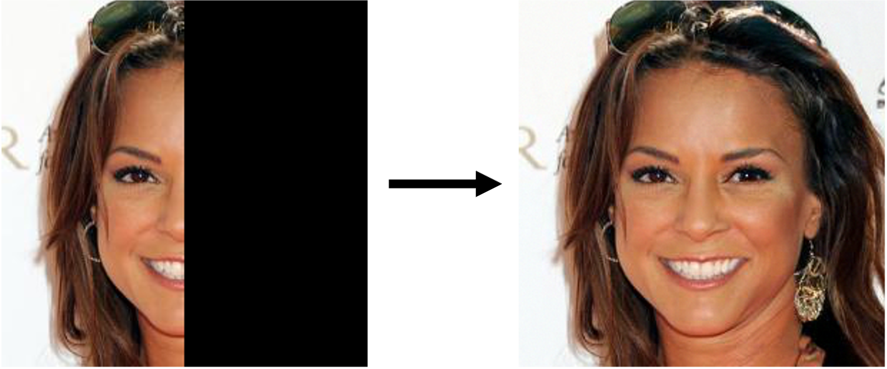

# Towards Coherent Image Inpainting Using Denoising Diffusion Implicit Models

This is the official impelmenation of the paper [Towards Coherent Image Inpainting Using Denoising Diffusion Implicit Models](https://arxiv.org/pdf/2304.03322.pdf).

## Abstract
Image inpainting refers to the task of generating a complete, natural image based on a partially revealed reference image. Recently, many research interests have been focused on addressing this problem using fixed diffusion models. These approaches typically directly replace the revealed region of the intermediate or final generated images with that of the reference image or its variants.  However, since the unrevealed regions are not directly modified to match the context, it results in incoherence between revealed and unrevealed regions. To address the incoherence problem, a small number of methods introduce a rigorous Bayesian framework, but they tend to introduce mismatches between the generated and the reference images due to the approximation errors in computing the posterior distributions. In this paper, we propose COPAINT, which can coherently inpaint the whole image without introducing mismatches. COPAINT also uses the Bayesian framework to jointly modify both revealed and unrevealed regions, but approximates the posterior distribution in a way that allows the errors to gradually drop to zero throughout the denoising steps, thus strongly penalizing any mismatches with the reference image. Our experiments verify that COPAINT can outperform the existing diffusion-based methods under both objective and subjective metrics.

## Requirements
### Environment
Install conda environment by running
```
conda env create -f environment.yaml
conda activate copaint
```
### Download pretrained models and data
```
bash scripts/download.sh
```
This script will download pretrained diffusion models from [guided-diffusion](https://github.com/openai/guided-diffusion) and [repaint](https://github.com/andreas128/RePaint).

Then it will download and preprocess `CelebA-HQ` dataset according to the data split in [Lama](https://github.com/saic-mdal/lama). The images we used for `ImageNet` dataset should be placed in `datasets/imagenet100`, which could be downloaded [here](https://drive.google.com/drive/folders/1CTBHK8udyGejJEob-HTL1MrmtkqC_3gr?usp=sharing).

## Usage
### Inpainting with `CoPaint`
To inpaint a specific image with our algorithm `CoPaint`, you can run 
```text
python main.py:
    --config_file: The configuration file, which specifies the model to use and some hyper-parameters for our method
    --input_image: The path to input image
    --mask:        The path to mask file 
    --outdir:      The path to output folder
    --n_samples:   The number of images to be generated
    --algorithm:   The algorithm to be used
```
Here is an example result on `CelebA-HQ` dataset with `CoPaint`:
```shell
python main.py --config_file configs/celebahq.yaml --input_image examples/celeb-sample.jpg --mask examples/celeb-mask.jpg --outdir images/example --n_samples 1 --algorithm o_ddim 
```
Here is an example result on `CelebA-HQ` dataset with `CoPaint-TT`:
```shell
python main.py --config_file configs/celebahq.yaml --input_image examples/celeb-sample.jpg --mask examples/celeb-mask.jpg --outdir images/example --n_samples 1 --algorithm o_ddim --ddim.schedule_params.jump_length 10 --ddim.schedule_params.jump_n_sample 2 --ddim.schedule_params.use_timetravel
```



### Tip:
You can tune following hyper-parameters if you are not satisfied with the generated image:
* `--optimize_xt.num_iteration_optimize_xt`: The number of optimization steps $G$.
* `--optimize_xt.lr_xt`: The initial learning rate $\mu_T$
Below are hyper-paremters for the time-travel trick:
* `--ddim.schedule_params.use_timetravel`: Whether to use time-travel trick.
* `--ddim.schedule_parms.jump_length` : The time-travel interval $\tau$.
* `--ddim.schedule_parms.jum_n_sample` : The time-travel frequency $K$.

Please refer to our paper for more details.

## Reproduce results in our paper
We provide shell scripts for all algorithms discussed in our paper, `copaint, repaint, copaint-tt`, you can find them in `scripts` folder. To run a specific algorithm on both datasets:
```shell
bash scripts/{algorithm}.sh
```
The generated images will be put in `images/{algorithm}`.

Below is an example to run `Copaint` on `CelebA-HQ` dataset with `half` mask:
```shell
python main.py --dataset_name celebahq --algorithm o_ddim --outdir celebresults --mask_type half --config_file configs/celebahq.yaml
```

## References
If you find our work useful for your research, please consider citing our paper:
```bibtex
@misc{zhang2023coherent,
      title={Towards Coherent Image Inpainting Using Denoising Diffusion Implicit Models},
      author={Guanhua Zhang and Jiabao Ji and Yang Zhang and Mo Yu and Tommi Jaakkola and Shiyu Chang},
      year={2023},
      eprint={2304.03322},
      archivePrefix={arXiv},
      primaryClass={cs.CV}
}
```

Our implementation is based on following repos:
* https://github.com/andreas128/RePaint
* https://github.com/bahjat-kawar/ddrm
* https://github.com/wyhuai/DDNM
* https://github.com/DPS2022/diffusion-posterior-sampling
